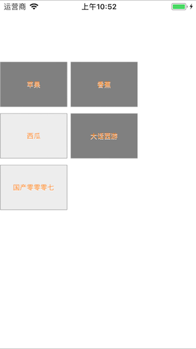

# YHJTagList

[](https://travis-ci.org/余洪江/YHJTagList)
[](http://cocoapods.org/pods/YHJTagList)
[](http://cocoapods.org/pods/YHJTagList)
[](http://cocoapods.org/pods/YHJTagList)


## Usage

To run the example project, clone the repo, and run `pod install` from the Example directory first.

## Requirements

## Installation

YHJTagList is available through [CocoaPods](http://cocoapods.org). To install
it, simply add the following line to your Podfile:

```ruby
pod "MRJTagList"
```

## use

```
MRJTagList *listView = [[MRJTagList alloc] initWithFrame:CGRectMake(0, 100, [UIScreen mainScreen].bounds.size.width, 100)];
    listView.tagDelegate = self;
    listView.automaticResize = YES;
    listView.bottomMargin = 10;
    listView.horizontalPadding = 5;
    listView.verticalPadding = 30;
    listView.minimumWidth = 100;
    listView.cornerRadius = 1.0;
    listView.font = [UIFont systemFontOfSize:11];
    listView.textColor = [UIColor orangeColor];
    [listView setTags:@[@"苹果", @"香蕉", @"西瓜", @"大话西游", @"国产零零零七"]];
//    listView.isTouch = NO;
    listView.labelMargin = 10;
    listView.isManySelect = YES;
    [self.view addSubview:listView];
```


```- (void)selectedTag:(NSString *)tagName tagIndex:(NSInteger)tagIndex {
    NSLog(@"-=-==-tagName=%@-=-=-=-tagindex=%ld", tagName, tagIndex);
}

- (void)selectedTag:(NSString *)tagName {
    NSLog(@"-------------selectedTag-%@", tagName);
}

- (void)tagListTagsChanged:(MRJTagList *)tagList {
    NSLog(@"-===0909090-=-=-=-%@", tagList);
}

/**
 *  多标签的代理方法
 *
 *  @param tagNames  多标签的名称
 *  @param tagIndexs 多标签的下标值
 */
- (void)selectedTags:(NSArray *)tagNames tagIndex:(NSArray *)tagIndexs {
    NSLog(@"****************%@________________%@", tagNames, tagIndexs);
}
```

## Author

余洪江, mrjlovetian@gmail.com

## License

## 新的使用方法


YHJTagList is available under the MIT license. See the LICENSE file for more info.


